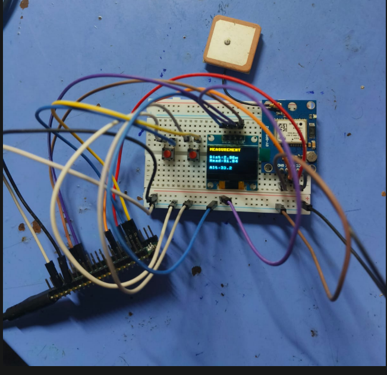

# Robot Telemetry Platform

A mobile robotic platform with **WiFi control and GPS telemetry**.

This project combines:

• ESP32 based WiFi robot car control  
• Raspberry Pi Pico based GPS telemetry system  
• OLED display for live GPS data  
• Distance and heading measurement between two points  

---

# Project Overview

The system consists of two main subsystems.

## 1. WiFi Robot Car

- Controlled through a web interface hosted on the ESP32
- Supports forward, reverse, left, right, stop and speed control
- Accessible from any device connected to the same WiFi network

## 2. GPS Telemetry System

- Uses a GPS module connected to a Raspberry Pi Pico
- Displays live GPS information on an OLED display
- Calculates distance and heading between two GPS points

---

# Hardware Used

## Robot Car

- ESP32
- L298N Motor Driver
- 2 DC Motors
- Battery Pack
- Chassis

## GPS Telemetry Unit

- Raspberry Pi Pico
- GPS Module (NEO-6M or similar)
- OLED Display (SSD1306)
- Push Buttons
- Breadboard
- Jumper wires

---

# System Architecture

## Robot Control Flow

User Phone  
↓  
ESP32 Web Server  
↓  
Motor Driver (L298N)  
↓  
DC Motors  

## GPS Telemetry Flow

GPS Module  
↓  
Raspberry Pi Pico  
↓  
Distance / Heading Calculation  
↓  
OLED Display  

---

# Features

- WiFi controlled robot car
- Live GPS telemetry
- Distance measurement between two GPS points
- Heading calculation between locations
- OLED display interface
- Web based robot control interface

---

# Hardware Setup



---

# Repository Structure

```
robot-telemetry-platform
│
├── wifi_robot_car.ino          → ESP32 robot controller
├── gps_telemetry_pico.py       → Pico GPS telemetry system
└── images
    └── gps_tracker_hardware.jpg
```

---

# How To Run

## ESP32 Robot Car

1. Open `wifi_robot_car.ino` in Arduino IDE
2. Install required ESP32 board support
3. Update WiFi credentials

```
const char* ssid = "YOUR_WIFI";
const char* password = "YOUR_PASSWORD";
```

4. Upload code to ESP32
5. Open Serial Monitor to get the ESP32 IP address
6. Open the IP in a browser to control the robot

---

## GPS Telemetry System

1. Flash MicroPython on Raspberry Pi Pico
2. Upload the following files:
   - `gps_telemetry_pico.py`
   - `ssd1306.py` (OLED driver)
3. Connect:
   - GPS module to UART
   - OLED to I2C
4. Run the script on the Pico

The OLED display will show:

- Latitude
- Longitude
- Satellites
- Speed
- Distance between two measured points
- Heading direction

---

# Future Improvements

- Real time GPS telemetry via WiFi
- Web dashboard with live map
- Autonomous navigation
- Obstacle detection sensors
- Mobile app control

---

# Author

Glisten Joshy  
Electronics and Embedded Systems Project
